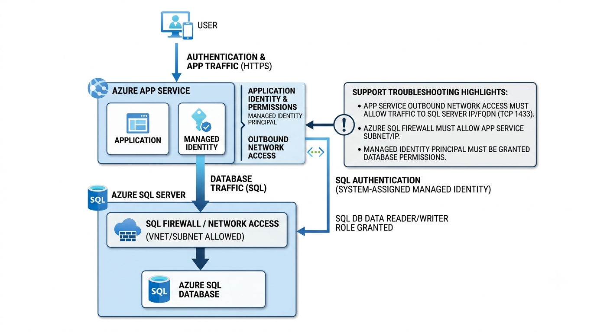

# Ticket-016: Azure App Service Cannot Connect to Azure SQL Database

## Ticket Information

| Field | Details |
|--------|---------|
| Ticket ID | ASL-016 |
| Priority | High |
| Service | Azure App Service / Azure SQL Database |
| Category | Application Connectivity |
| Status | Resolved |

---

## Customer Issue

The customer said their web application was working normally earlier, but suddenly started showing database connection errors.

The application was hosted on Azure App Service and the database was hosted on Azure SQL Database.

---

## What I Checked

I started by checking whether the App Service itself was running. It was running normally, so I moved on to the database side.

I checked the Azure SQL Database status and confirmed that the database was available.

Next, I checked the connection settings used by the application and then reviewed the SQL Database firewall configuration.

The application was running from Azure App Service, but the required access from the application environment was not allowed by the database network configuration.

---

## Troubleshooting

### 1. Checked App Service

- Confirmed the App Service was in the Running state.
- Opened the application and confirmed that the application itself was responding.
- Checked the application logs for database connection errors.

### 2. Checked Azure SQL Database

- Confirmed that the SQL Database was available.
- Verified that the database server was reachable.
- Checked the configured firewall rules.

### 3. Checked Network Access

The database firewall configuration did not allow the required connection from the App Service environment.

This explained why the application was running but could not retrieve data from the database.

---

## Root Cause

The application was healthy, but the Azure SQL Database firewall configuration was preventing the App Service from connecting to the database.

---

## Resolution

Updated the Azure SQL Database network access configuration to allow the required application traffic.

Only the required access was allowed instead of opening the database broadly to the internet.

---

## Verification

After updating the configuration:

1. Restarted the application.
2. Opened the application again.
3. Confirmed that database-dependent pages were loading.
4. Checked the application logs for new connection errors.
5. Confirmed that the application could read data from the database.

The application was working normally again.

---

## What I Learned

- An application can be running normally while its database connection is failing.
- Always separate application-level problems from network-level problems.
- Azure SQL firewall rules should be checked when an application suddenly loses database connectivity.
- Database access should be restricted to the required sources instead of allowing unrestricted internet access.

---

## Azure Services Used

- Azure App Service
- Azure SQL Database
- Azure Portal

---

## Ticket Status

**Resolved**
