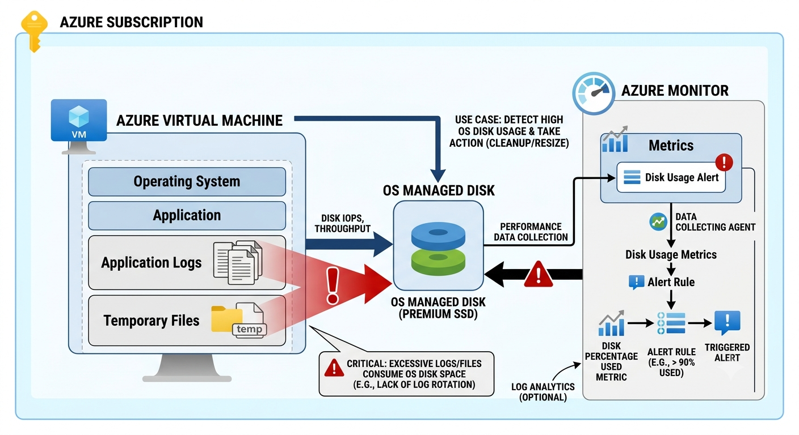

# Ticket-020: Azure VM Disk Space Running Low

## Ticket Information

| Field | Details |
|--------|---------|
| Ticket ID | ASL-020 |
| Priority | High |
| Service | Azure Virtual Machine |
| Category | Performance / Storage |
| Status | Resolved |

---

## Customer Issue

The customer reported that their application on an Azure VM was becoming slow and some operations were failing.

---

## What I Checked

I checked the VM status and confirmed that it was running normally.

I then checked the disk usage inside the VM and found that the OS disk was almost full.

---

## Troubleshooting

- Checked VM health and status.
- Reviewed disk space inside the VM.
- Identified unnecessary temporary files and old logs.
- Removed unnecessary files.
- Monitored the available disk space after cleanup.

---

## Root Cause

The VM's OS disk was running out of available space, which was affecting application performance.

---

## Resolution

Cleaned up unnecessary files and logs from the VM and freed additional disk space.

---

## Verification

- Confirmed sufficient free disk space.
- Restarted the affected application.
- Verified that the application was responding normally.
- Confirmed that the previous errors were no longer occurring.

---

## What I Learned

- Low disk space can affect application performance.
- VM health should be checked along with resource usage when troubleshooting performance issues.
- Regular disk monitoring can help prevent unexpected application failures.

---

## Azure Services Used

- Azure Virtual Machine
- Azure Portal
- Azure Monitor

---

## Ticket Status

**Resolved**
